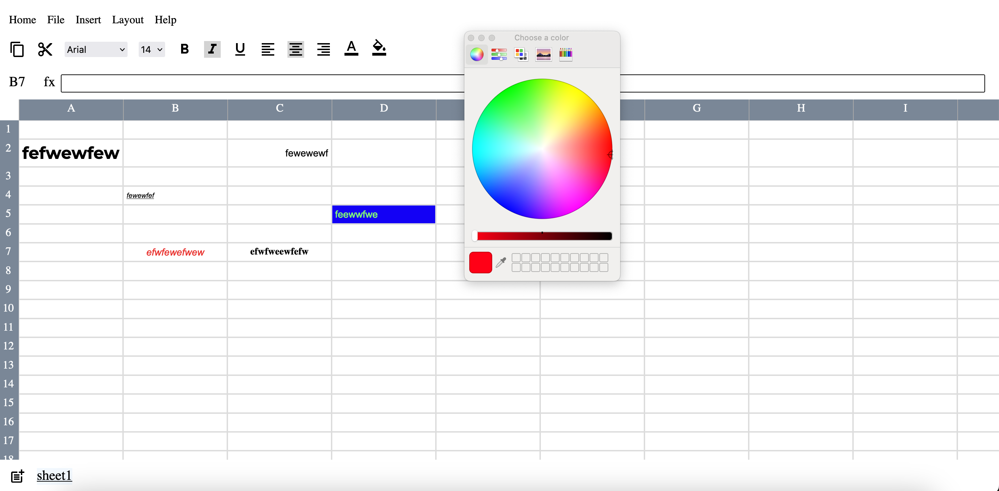

# Google Sheets Clone:
> A spreadsheet editing app build using Reactjs.

## Screenshot:

## Features: 

#### Current:
1. Editing cells.
2. Applying styles to cells.
   1. Bold.
   2. Italic.
   3. Underline.
   4. Alignment (left, center, right)
   5. Font Family.
   6. Font Size.
   7. Color.
   8. Background Color.
3. Creating and Editing multiple sheets.

#### In Development:

1. Formula Evaluation.
2. Convert sheets to csv.
3. Converting from csv to app sheets.
4. Copy & Pasting of cells including their styles.

#### Some Insights:

- Optimization:
  - A lot of optimizations were made to how each component should render so as to avoid re rendering of complete app whenever a single cell is being edited.
  - Multiple changes were made to how the state was being stored so as to make the optimizations.
  - React.memo was used to make sure re rendering is done properly and when required.
- CSS:
  - Flexbox is used heavily.
  - Some tricks involving opacity set to 0, to hide a component but make sure it's clickable etc were used to display icons for color changing.